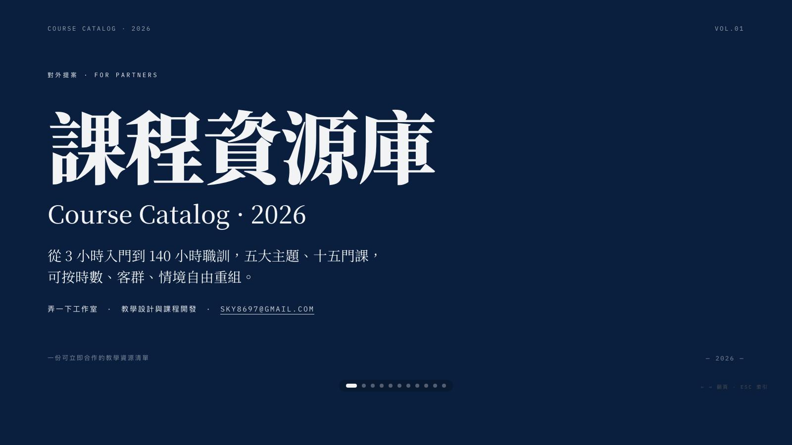
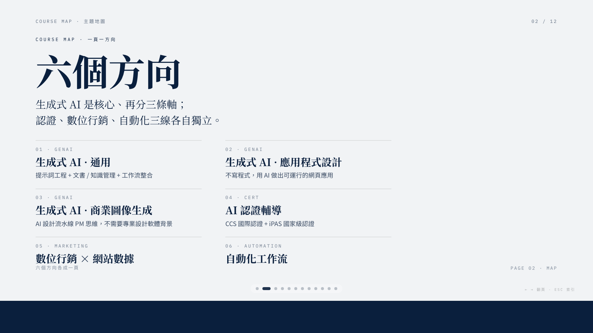
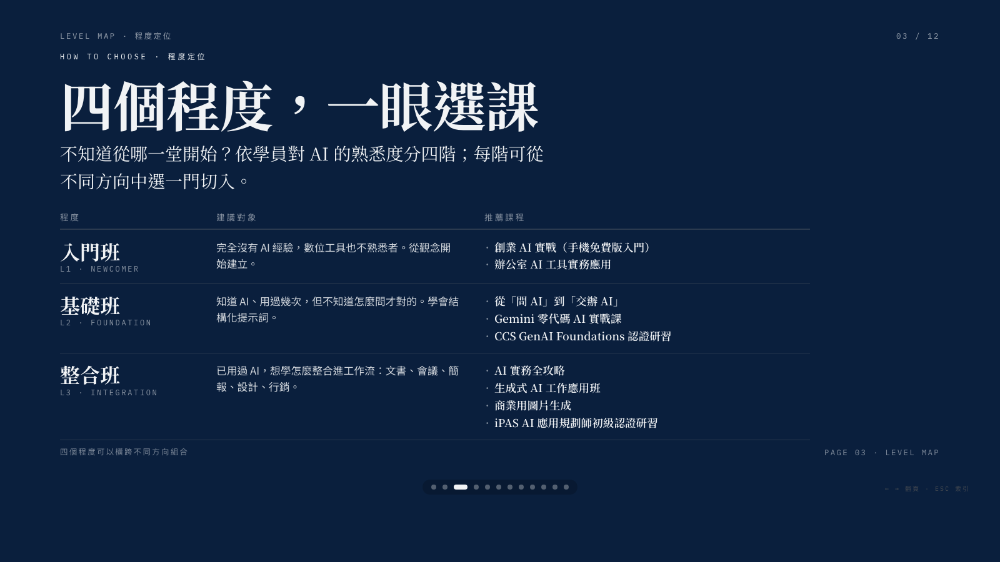
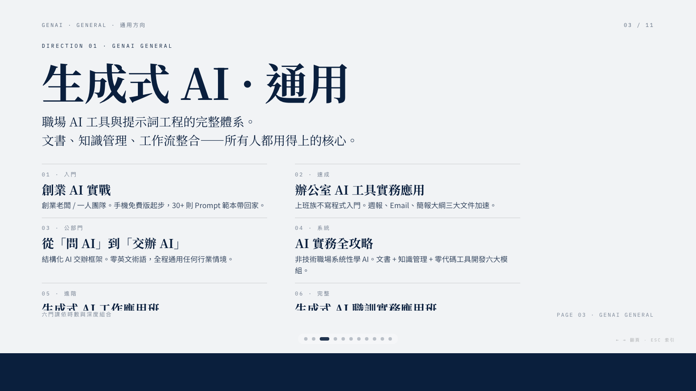
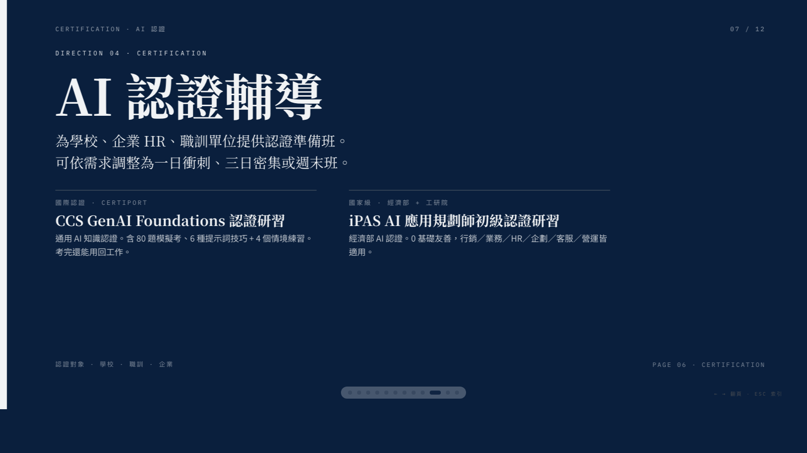
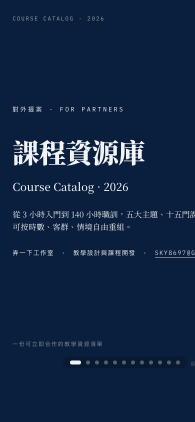
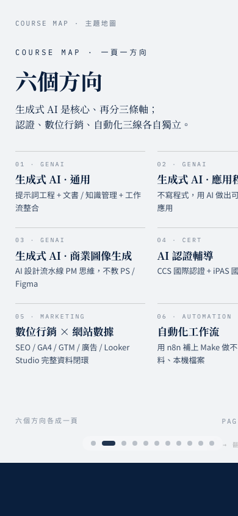

# 課程資源庫 · Course Catalog 2026

弄一下工作室對外提案簡報。橫向翻頁網頁 PPT，單一 HTML 檔。

**線上預覽：** https://skypai0326.github.io/course-catalog-2026/

---

### 手機版

  
  

---

## 聯繫

**sky8697@gmail.com** — 有合作或客製需求請寄信來，告訴我們客群、時數與目標，我們從現有資源庫重組出最貼合的方案。

---

## 內容結構（共 12 頁）

| # | 主題 | 內容 |
|---|---|---|
| 1 | 封面 | 課程資源庫 · 2026 |
| 2 | 主題地圖 | 六個方向總覽 |
| 3 | 程度定位 | 入門班／基礎班／整合班／協思班 四階對應推薦課程 |
| 4 | 生成式 AI · 通用 | 6 門課（從 Prompt 入門到完整職訓） |
| 5 | 生成式 AI · 應用程式設計 | Gemini 零代碼 AI 實戰課 |
| 6 | 生成式 AI · 商業圖像生成 | 商業用圖片生成（PM 思維） |
| 7 | AI 認證輔導 | CCS / iPAS 兩條路徑 |
| 8 | 數位行銷 × 網站數據 | 完整體系 + 學期路線 + 單點專題 |
| 9 | 自動化工作流 | n8n 本機版實戰 |
| 10 | 開課實績 | 已合作對象與時數規模（概略條列） |
| 11 | 教學設計原則 | 「我們不賣標準品」 |
| 12 | CTA | 開始合作 + 聯繫信箱 |

## 操作

- `← →` 翻頁
- 滾輪 / 觸控滑動
- `ESC` 顯示總覽縮圖
- URL `#N` 可直接跳到指定頁（例如 `/#5`）
- URL 加 `?static` 跳過動效（用於截圖、列印、嵌入 iframe）

## 技術

- 單一 HTML 檔案，無建置流程
- WebGL shader 雙背景（深色：色散；淺色：流動）
- Motion One 動效（CDN）+ 保險絲（RAF 卡住時 2.8s 強制顯示）
- Lucide icons / Google Fonts（Noto Serif TC + Playfair + Inter）
- 主題色：🌊 靛蓝瓷
- **流體字級**：所有字級用 `clamp(min, Nvw, max)`，桌機/平板/手機自動縮放
- **手機優化**：媒體查詢分 900px / 600px 兩段；grid 收疊、frame 內捲動避免溢出

## 來源

由 [guizang-ppt-skill](https://github.com/guizang) 模板產出，部署為獨立提案站。
