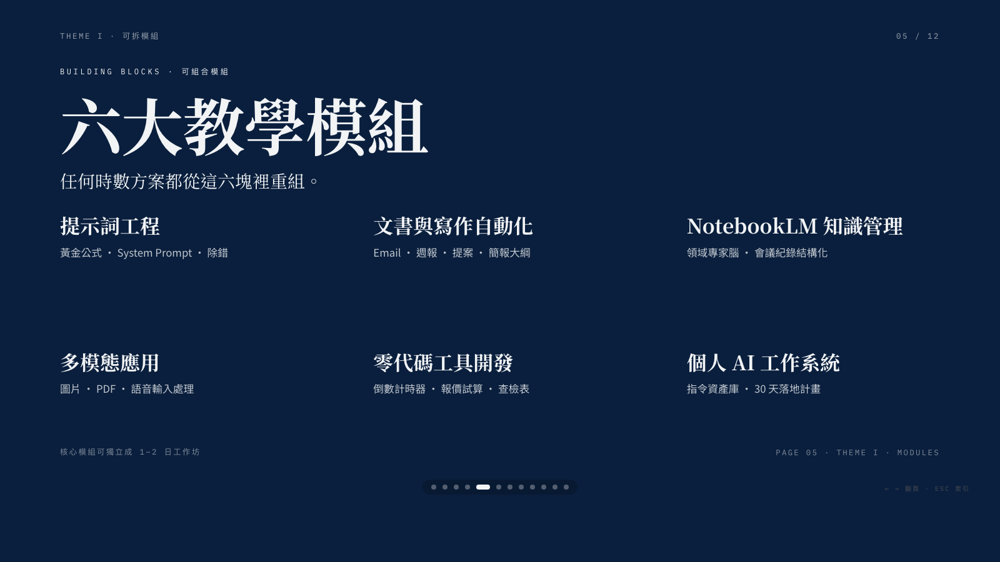

# 課程資源庫 · Course Catalog 2026

弄一下工作室對外提案簡報。橫向翻頁網頁 PPT，單一 HTML 檔。

**線上預覽：** https://skypai0326.github.io/course-catalog-2026/

---

---

## 內容結構（共 12 頁）

| # | 主題 | 內容 |
|---|---|---|
| 1 | 封面 | 課程資源庫 · 2026 |
| 2 | 概覽數據 | 15 門課 / 5 主題 / 3h–140h / 5+ 機構 |
| 3 | 五大主題幕封 | — |
| 4 | 主題 I · 生成式 AI | 5 階時數光譜（pipeline） |
| 5 | 主題 I · 教學模組 | 6 大可組合模組 |
| 6 | 主題 II · AI 認證 | CCS / iPAS |
| 7 | 主題 III · 數位行銷 | 弄一下 70h vs NTUB 60h |
| 8 | 主題 IV & V | 自動化 + AI 圖像 |
| 9 | 教學設計原則 | 「我們不賣標準品」 |
| 10 | 客製化機制 | 時數 / 客群 / 教材 / 情境四向 |
| 11 | 已合作對象 | 大學 / 政府 / 職訓 / 企業 |
| 12 | CTA | 開始合作 |

## 操作

- `← →` 翻頁
- 滾輪 / 觸控滑動
- `ESC` 顯示總覽縮圖
- 第 4 頁 pipeline：按 `→` 或空格逐階點亮
- URL `#N` 可直接跳到指定頁（例如 `/#5`）
- URL 加 `?static` 跳過動效（用於截圖、列印、嵌入 iframe）

## 技術

- 單一 HTML 檔案，無建置流程
- WebGL shader 雙背景（深色：色散；淺色：流動）
- Motion One 動效（CDN）
- Lucide icons / Google Fonts（Noto Serif TC + Playfair + Inter）
- 主題色：🌊 靛蓝瓷

## 來源

由 [guizang-ppt-skill](https://github.com/guizang) 模板產出，部署為獨立提案站。
